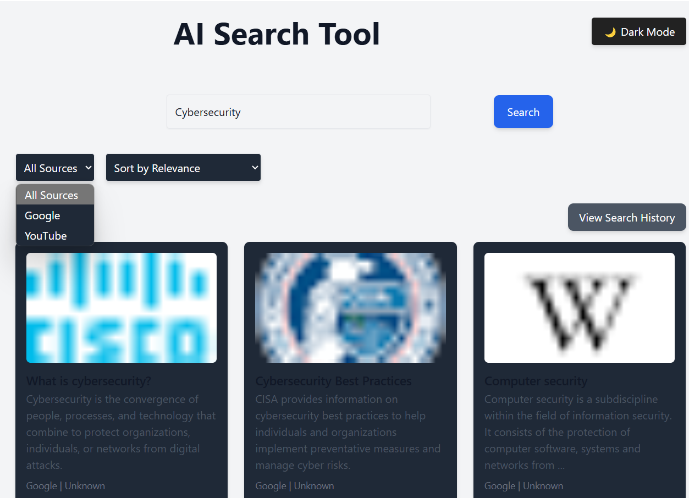

<h1>AI-Powered Search Tool</h1>
# 🚀 AI-Powered Search & Aggregation Tool  

   
  <strong>Search Page</strong>

   
  <strong>Results</strong>

   
  <strong>Div with Dark mode</strong>

## 📌 Project Overview  
This is a full-stack web application that allows users to **search across Google & YouTube** and get structured results efficiently. It features **real-time search, filtering, sorting, search history tracking, and smooth animations** for a great user experience.

## 🎯 Key Features  
✅ **Multi-Source Search** - Fetches results from **Google (SerpAPI)** and **YouTube (YouTube API)**  
✅ **Real-Time Search** - Instantly fetches and displays search results  
✅ **Filtering & Sorting** - Users can filter results by **Google/YouTube** and sort by **date/relevance**  
✅ **Search History Tracking** - Stores past searches with an easy **toggle history** feature  
✅ **Modern UI & Animations** - **Framer Motion** animations for a sleek experience  
✅ **API-Driven Backend** - Built with **Django & Django REST Framework**  
✅ **Secure API Key Management** - Uses **.env files** for API keys  
✅ **Scalable & Ready for Deployment**  

## 🛠 Tech Stack  
- **Frontend:** React.js, TailwindCSS, Framer Motion  
- **Backend:** Django, Django REST Framework  
- **APIs Used:** SerpAPI (Google Search), YouTube Data API v3  
- **Database:** SQLite (Expandable to PostgreSQL/MySQL)  
- **Deployment (Planned):** Backend on **Render**, Frontend on **Vercel**  

## 🎨 UI/UX Enhancements  
🔹 **Hover animations** on search results cards  
🔹 **Smooth opening/closing animations** for search history  
🔹 **Modern UI layout with better spacing & responsiveness**  

---